<!-- PROFILE:START -->

<!-- HERO SECTION -->
<a href="https://github.com/Shriyan2407">
  
</a>

 

<!-- QUICK STATS (4 HUD METRICS) -->
<a href="https://github.com/Shriyan2407?tab=repositories">
  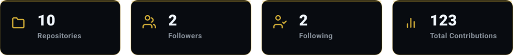
</a>

  

<!-- ROW 2: ABOUT ME & CURRENTLY (2-COLUMN GRID) -->
<table width="100%" border="0" cellspacing="0" cellpadding="0" style="border-collapse: collapse; border: none;">
  <tr>
    <td width="50%" valign="top" align="center" style="padding-right: 6px; border: none;">
      <a href="https://www.linkedin.com/in/shriyan-bohra-647057386/">
        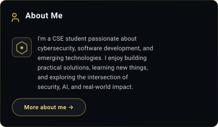
      </a>
    </td>
    <td width="50%" valign="top" align="center" style="padding-left: 6px; border: none;">
      <a href="https://github.com/Shriyan2407">
        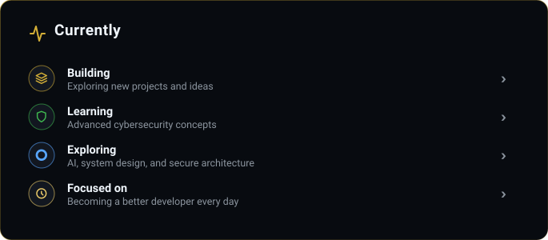
      </a>
    </td>
  </tr>
</table>

 

<!-- ROW 3: TECH STACK COMMAND CENTER -->
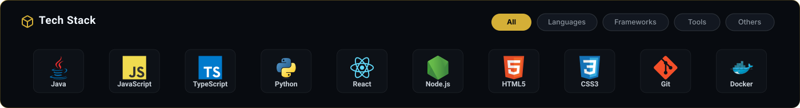

  

<!-- ROW 4: FEATURED REPOSITORIES -->

 

<!-- 4 FEATURED REPOSITORY CARDS -->
<table width="100%" border="0" cellspacing="0" cellpadding="0" style="border-collapse: collapse; border: none;">
  <tr>
    <td width="25%" valign="top" align="center" style="padding: 3px; border: none;">
      <a href="https://github.com/Shriyan2407/nebulavoltage">
        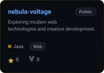
      </a>
    </td>
    <td width="25%" valign="top" align="center" style="padding: 3px; border: none;">
      <a href="https://github.com/Shriyan2407/sameer">
        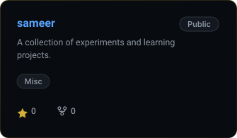
      </a>
    </td>
    <td width="25%" valign="top" align="center" style="padding: 3px; border: none;">
      <a href="https://github.com/Shriyan2407/xrvision">
        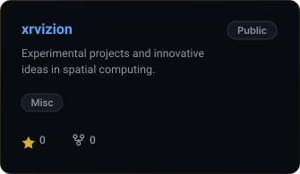
      </a>
    </td>
    <td width="25%" valign="top" align="center" style="padding: 3px; border: none;">
      <a href="https://github.com/Shriyan2407/r-h-t-i-h">
        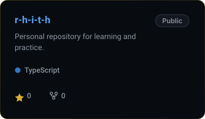
      </a>
    </td>
  </tr>
</table>

  

<!-- ROW 5: CONTRIBUTION MATRIX -->
<a href="https://github.com/Shriyan2407">
  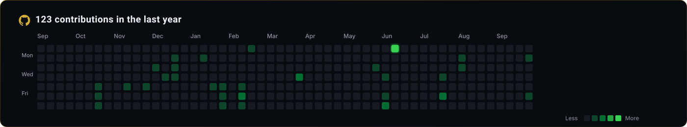
</a>

  

<!-- ROW 6: RECENT ACTIVITY & CONTRIBUTION STATS -->
<table width="100%" border="0" cellspacing="0" cellpadding="0" style="border-collapse: collapse; border: none;">
  <tr>
    <td width="50%" valign="top" align="center" style="padding-right: 6px; border: none;">
      <a href="https://github.com/Shriyan2407?tab=overview">
        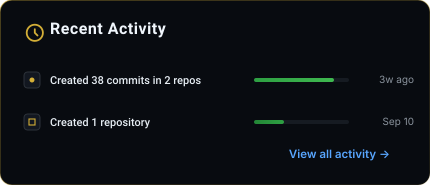
      </a>
    </td>
    <td width="50%" valign="top" align="center" style="padding-left: 6px; border: none;">
      <a href="https://github.com/Shriyan2407">
        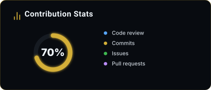
      </a>
    </td>
  </tr>
</table>

  

<!-- ROW 7: CINEMATIC FOOTER & SOCIAL CONNECT -->
<a href="https://github.com/Shriyan2407">
  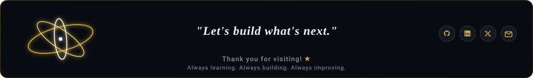
</a>

 

&quot;Discipline turns ideas into reality. ★&quot;

<!-- PROFILE:END -->
