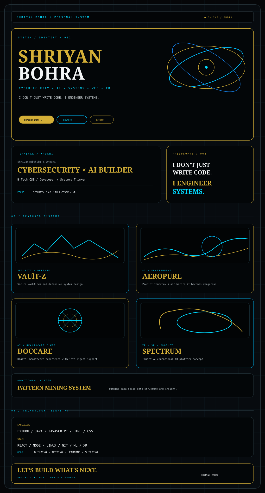

 

  

<a href="https://github.com/Shriyan2407">GITHUB</a>
&nbsp;&nbsp;•&nbsp;&nbsp;
<a href="https://www.linkedin.com/in/shriyan-bohra-647057386/">LINKEDIN</a>
&nbsp;&nbsp;•&nbsp;&nbsp;
<a href="https://xr-vision-pro.vercel.app/">PORTFOLIO</a>

  

BUILD → BREAK → LEARN → REBUILD

