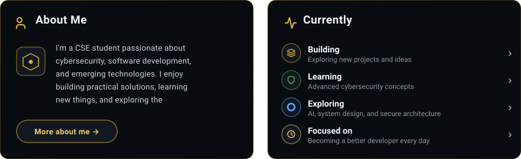
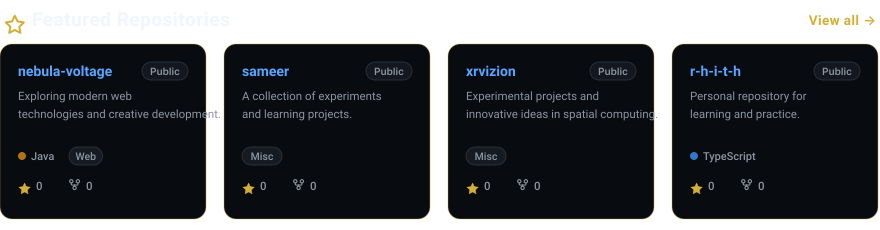
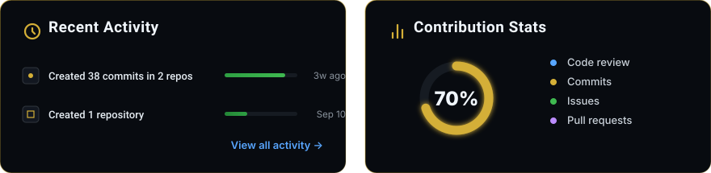

<!-- PROFILE:START -->

<!-- HERO SECTION -->

 

<!-- QUICK STATS (4 HUD METRICS) -->

  

<!-- ROW 2: ABOUT ME & CURRENTLY (SEAMLESS DUAL-CARD HUD) -->

  

<!-- ROW 3: TECH STACK COMMAND CENTER -->

  

<!-- ROW 4: FEATURED REPOSITORIES (SEAMLESS 4-PROJECT GRID) -->

  

<!-- ROW 5: CONTRIBUTION MATRIX -->

  

<!-- ROW 6: RECENT ACTIVITY & CONTRIBUTION STATS (SEAMLESS DUAL-CARD HUD) -->

  

<!-- ROW 7: CINEMATIC FOOTER & SOCIAL CONNECT -->

 

&quot;Discipline turns ideas into reality. ★&quot;

<!-- PROFILE:END -->
