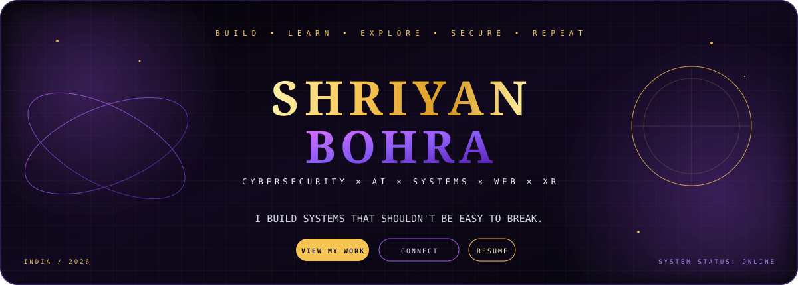
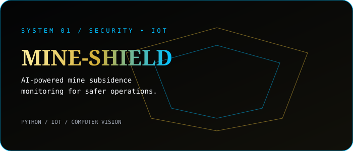
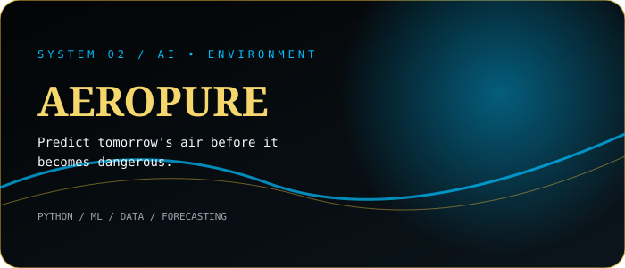
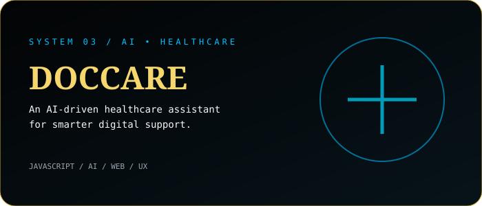
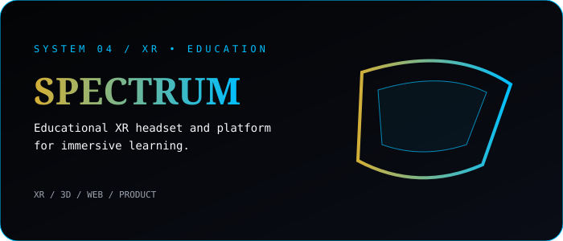
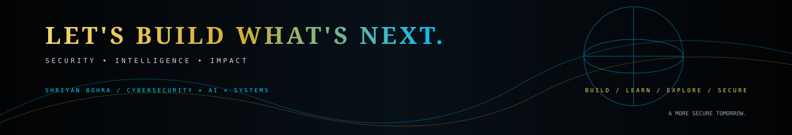

<div align="center">



<br/>


<br/>

<a href="https://github.com/Shriyan2407"></a>
<a href="https://www.linkedin.com/in/shriyan-bohra-647057386/"></a>
<a href="https://xr-vision-pro.vercel.app/"></a>

</div>

---

## `SYSTEM // IDENTITY`

<table>
<tr>
<td width="56%" valign="top">

### `shriyan@github:~$ whoami`

```text
┌──────────────────────────────────────────────────────┐
│  SHRIYAN BOHRA                                       │
│  ──────────────────────────────────────────────────  │
│  ROLE      Computer Science Engineer                 │
│  FOCUS     Cybersecurity / AI / Systems              │
│  BUILD     Full-Stack / ML / XR                      │
│  MINDSET   Security-first • Product-minded           │
│  STATUS    ● ALWAYS BUILDING                         │
└──────────────────────────────────────────────────────┘
```

</td>
<td width="44%" valign="top">

### `CORE DIRECTIVES`

**01 / SECURE**  — think like an attacker. build like a defender.

**02 / INTELLIGENT** — turn data into decisions.

**03 / ENGINEER** — make ambitious ideas executable.

**04 / EXPLORE** — XR, 3D and emerging interfaces.

**05 / SHIP** — prototypes become products through iteration.

</td>
</tr>
</table>

<div align="center">

### **I DON'T JUST WRITE CODE. I ENGINEER SYSTEMS.**

`CYBERSECURITY` &nbsp; `ARTIFICIAL INTELLIGENCE` &nbsp; `SOFTWARE ENGINEERING` &nbsp; `XR`

</div>

---

## `01 // FEATURED SYSTEMS`

<table>
<tr>
<td width="50%" valign="top">

<a href="https://github.com/Shriyan2407/VAUlT-Z"></a>

**MINE-SHIELD**  ·  `SECURITY / IOT / AI`

AI-powered mine subsidence monitoring concept for safer operations.

<a href="https://github.com/Shriyan2407/VAUlT-Z">VIEW SYSTEM →</a>

</td>
<td width="50%" valign="top">

<a href="https://github.com/Shriyan2407/aerova"></a>

**AEROPURE**  ·  `AI / ML / DATA`

Predict tomorrow's air before it becomes dangerous.

<a href="https://github.com/Shriyan2407/aerova">VIEW SYSTEM →</a>

</td>
</tr>
<tr>
<td width="50%" valign="top">

<a href="https://github.com/Shriyan2407/DOCCARE"></a>

**DOCCARE**  ·  `AI / HEALTHCARE / WEB`

AI-oriented healthcare experience focused on simpler digital support.

<a href="https://github.com/Shriyan2407/DOCCARE">VIEW SYSTEM →</a>

</td>
<td width="50%" valign="top">

<a href="https://github.com/Shriyan2407/xrvision"></a>

**SPECTRUM**  ·  `XR / 3D / PRODUCT`

Educational XR headset and platform concept for immersive learning.

<a href="https://github.com/Shriyan2407/xrvision">VIEW SYSTEM →</a>

</td>
</tr>
</table>

<div align="center">

<a href="https://github.com/Shriyan2407/Pattern-Mining-System"><b>⛏ PATTERN MINING SYSTEM</b></a> — extracting structure from data and turning noise into insight.

</div>

---

## `02 // TECHNOLOGY`

<div align="center">


<br/><br/>

`PYTHON` · `JAVA` · `JAVASCRIPT` · `REACT` · `NODE.JS` · `LINUX` · `GIT` · `MACHINE LEARNING` · `DATA MINING` · `XR / 3D`

</div>

---

## `03 // GITHUB TELEMETRY`

<div align="center">


<br/><br/>


</div>

---

## `04 // CURRENT OPERATIONS`

<table>
<tr>
<td width="50%" valign="top">

```text
01  SECURITY
    Deepening cybersecurity foundations

02  INTELLIGENCE
    Building practical AI / ML systems

03  ENGINEERING
    Shipping stronger full-stack products
```

</td>
<td width="50%" valign="top">

```text
04  IMMERSION
    Exploring XR + 3D experiences

05  RESEARCH
    Hackathons + experimentation

06  PRODUCT
    Turning prototypes into real systems
```

</td>
</tr>
</table>

---

## `05 // SIGNALS`

<div align="center">

**🏆 ALGOMATH DATATHON — WINNER**  &nbsp; · &nbsp; **IEEE — TECHNICAL TEAM**  &nbsp; · &nbsp; **CUDA PROGRAM — TECHNICAL TEAM**

**SPORTS COMMITTEE — TECHNICAL TEAM**  &nbsp; · &nbsp; **HACKATHONS — BUILDER**

</div>

---

## `06 // THE BUILD LOOP`

<div align="center">

`OBSERVE`  →  `QUESTION`  →  `BUILD`  →  `BREAK`  →  `LEARN`  →  `SHIP`  →  `REPEAT`

<br/><br/>

> **Consistency is a form of self-respect.**

</div>

---

<div align="center">



<br/>

<a href="https://github.com/Shriyan2407"></a>
<a href="https://www.linkedin.com/in/shriyan-bohra-647057386/"></a>

### `BUILD → BREAK → LEARN → REBUILD`

<sub>SHRIYAN BOHRA • CYBERSECURITY × AI × SYSTEMS</sub>

</div>
